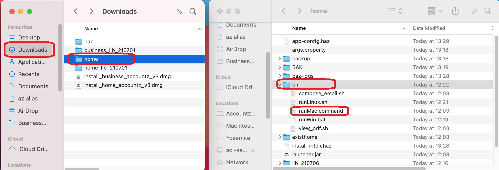

## How to install Home on Mac

Home Accountz requires **Oracle Java 8** (not Open JDK) in order to run. 

1. Download the correct Java for your operating system. Follow the instructions to install Java: <https://www.java.com/en/download/help/mac_install.html> 
4. Download the program from here:   
   <https://github.com/accountz-open/download/releases/download/beta_21.07.09/haz_install_210709.zip>
5. Open the zipped folder 
7. Open the `bin` folder
8. Double click on the relevant file to you:  
   `runMac`  
   
   
   
   You will be told the file is from an unidentified developer. 
   
   
   
9. Go to the Apple icon and select System Preferences
   
   
   
9. On the General Tab click ‘Open Anyway’
9. Select Open when asked and Home Accountz will open

   
   
9. To run the program each time go back to step 5. Or you could create a shortcut of the `runMac`

If you have a Home Accountz backup go to File> Restore a backup and select your backup file.

Please see this thread for details on how to make a backup.
<http://homehelp.accountz.com/how_to_make_a_backup_on_a_memory_stick.html>

To restore your data by navigating to File > Restore a Backup. Please see this link:
<http://homehelp.accountz.com/how_to_restore_a_backup_from_memory_stick.html>

   
