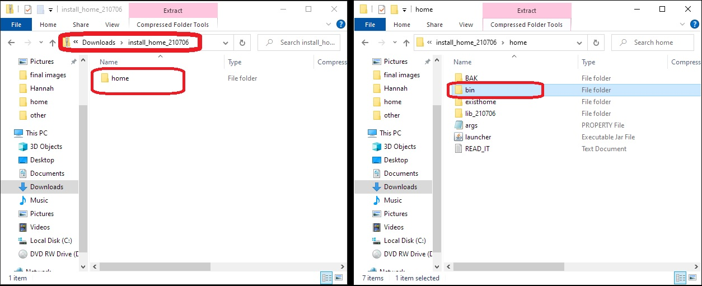
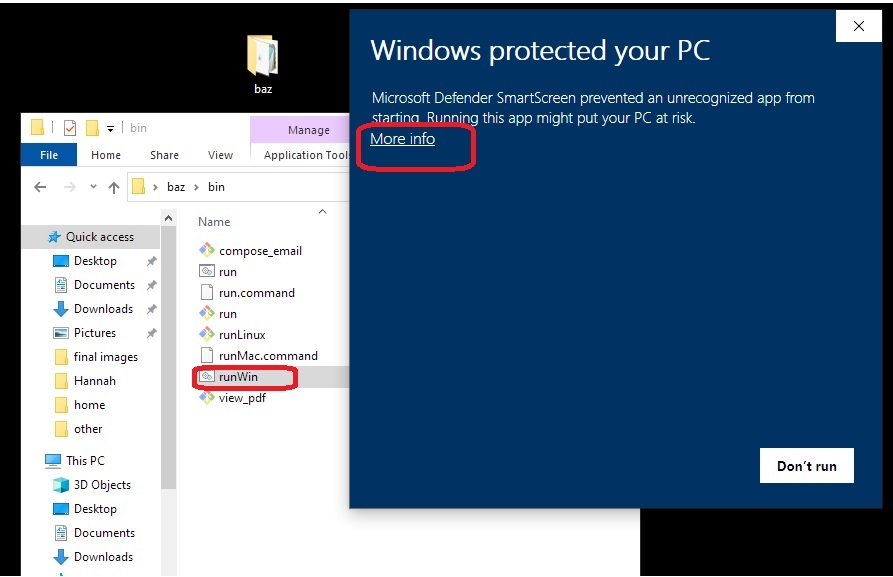
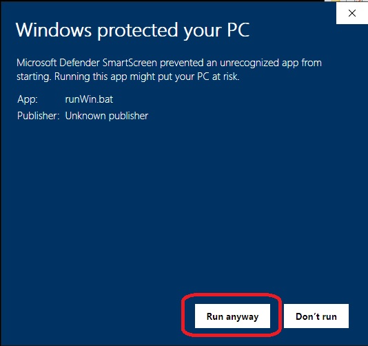

## How to install Home on Windows

Home Accountz requires **Oracle Java 8** (not Open JDK) in order to run. 

1. Download the correct Java for your operating system. Follow the instructions to install Java: <https://www.java.com/en/download/help/windows_manual_download.html>
4. Download the program from here:   
   <https://github.com/accountz-open/download/releases/download/21.07.19/home_install_210719.zip>
5. Open the zipped folder 
6. Drag the `home` folder onto your desktop and open it
7. Open the `bin` folder
8. Double click on the relevant file to you:  
   `runWin` 

   
   
9. You will get a Windows message about it being an unrecognized application. 
9. Click More Info  

   

9. Select Run anyway

   
   
9. Double click `runWin` again to open Home Accountz
9. To run the program each time go back to step 5. Or you could create a shortcut of the `runWin.bat`

For the more advanced see this article: <https://www.windowscentral.com/how-create-and-run-batch-file-windows-10>

If you have a Home Accountz backup go to File > Restore a backup and select your backup file.

By default backups are saved in the BAK folder.

Please see this thread for details on how to **make a backup** on a USB.
<http://homehelp.accountz.com/how_to_make_a_backup_on_a_memory_stick.html>

To restore your data by navigating to File > **Restore a Backup**. Please see this link:
<http://homehelp.accountz.com/how_to_restore_a_backup_from_memory_stick.html>
