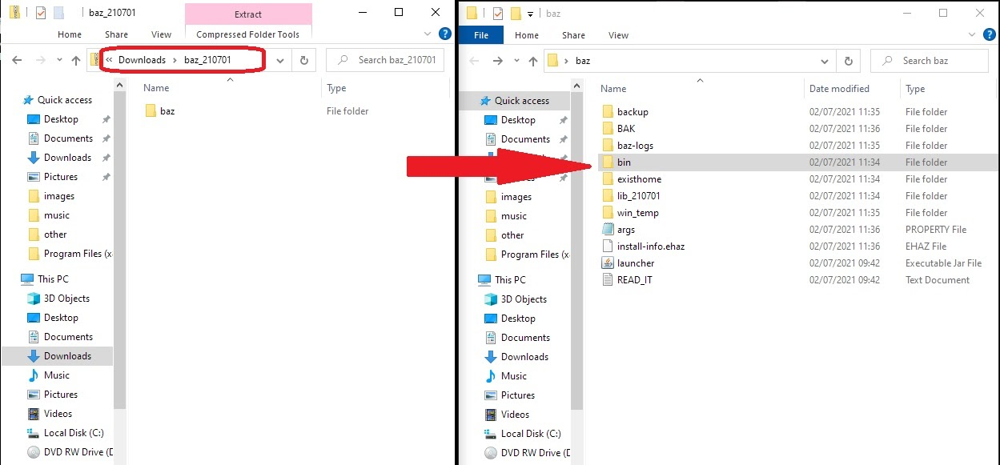

## How to install Home

Home Accountz requires **Oracle Java 8** (not Open JDK) in order to run. 

1. Download the correct Java for your operating system:   
   <https://www.oracle.com/java/technologies/javase-jre8-downloads.html>
3. Follow the instructions to install Java
4. Download the program from here:   
   <https://accountz-open.github.io/download/home/home_210701.zip>
5. Open the zipped folder you just downloaded
6. Drag the `haz` folder onto your desktop
7. Open the `bin` folder
8. Double click on the relevant file to you:  
   `run_windows`  
   or  
   `run_mac`  
   or  
   `run_linux` 

If you have a Business Accountz backup go to File> Restore a backup and select your backup file.
