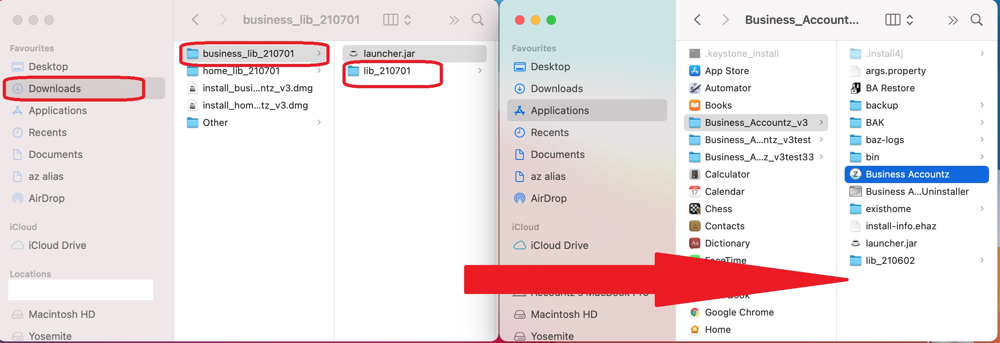

## How to update Business on Mac

**NOTE**: images may differ from lib folder name

1. Close Business Accountz
2. Download the zipped folder from here:    
   <https://github.com/accountz-open/download/releases/download/beta_21.07.09/business_lib_210709.zip>   
3. Open the zipped folder named `baz_lib_210709`
4. Drag **ONLY** the `lib_210709` folder into the Business_Accountz_v3 installation folder   
  
   `Applications/Business_Accountz_v3`  
     
    

5. Open Business Accountz as you would usually.

