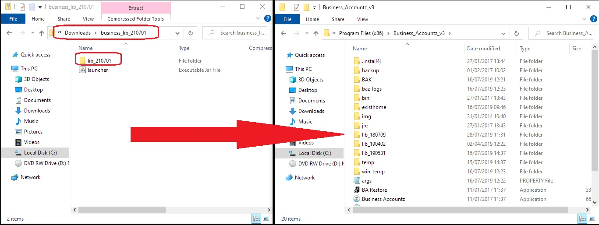

## How to update BAZ on Windows

**NOTE**: images may differ from lib folder name

1. Close Business Accountz    
2. Download the zipped folder from here:      
   <https://github.com/accountz-open/download/releases/download/21.07.19/business_lib_210719.zip>
3. Open the zipped folder named `business_lib_210719`
4. Drag **ONLY** the `lib_210719` folder into the Business_Accountz_v3 installation folder    
   Installation folders depend on your computer:    
    
   `C:\Program Files\Business_Accountz_v3`    
   or    
   `C:\Program Files(x86)\Business_Accountz_v3`    
    
    
   
   
5. Open Business Accountz as you would usually.

