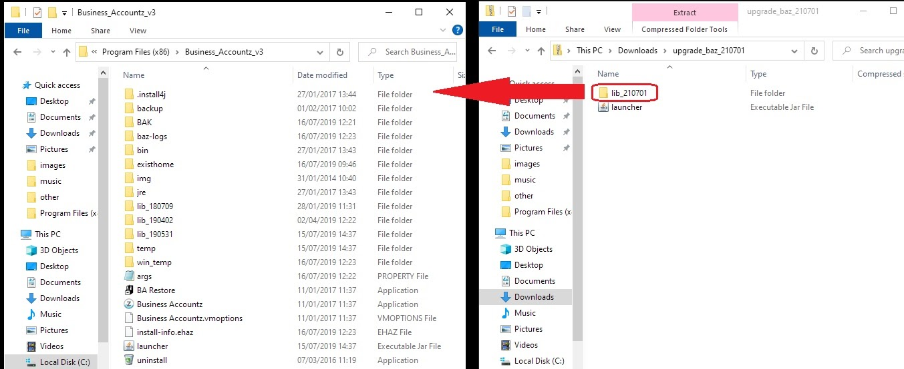

## How to update BAZ

1. Close Business Accountz    
2. Download the zipped folder from here:      
   <https://github.com/accountz-open/download/releases/download/beta_21.07.09/business_lib_210709.zip>
3. Open the zipped folder named `upgrade_baz_210701`
4. Drag the `lib_210701` folder into the Business_Accountz_v3 installation folder    
   Installation folders depend on your computer    
    
   **Windows**:    
   `C:\Program Files\Business_Accountz_v3`    
   or    
   `C:\Program Files(x86)\Business_Accountz_v3`    
    
   **Mac**:    
   `/Applications/Business_Accountz_v3`
    
   
   
5. Open Business Accountz as you would usually.

