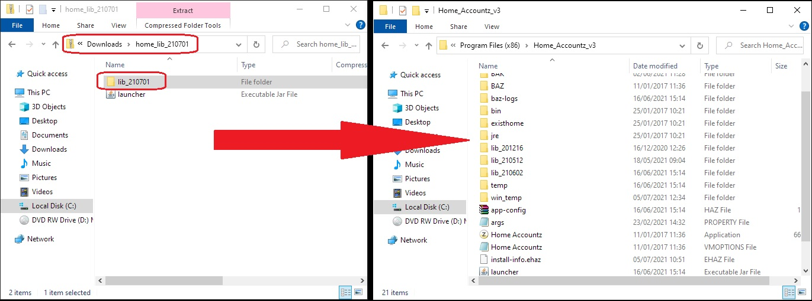

## How to update Home on Windows

**NOTE**: images may differ from lib folder name

1. Close Home Accountz
2. Download the zipped folder from here:    
   <https://github.com/accountz-open/download/releases/download/21.07.19/home_lib_210719.zip>   
3. Open the zipped folder named `home_lib_210713`
4. Drag **ONLY** the `lib_210713` folder into the Home_Accountz_v3 installation folder    
   Installation folders depend on your computer:    
  
   `C:\Program Files\Home_Accountz_v3`  
    or   
    `C:\Program Files(x86)\Home_Accountz_v3`  
     
    

5. Open Home Accountz as you would usually.

