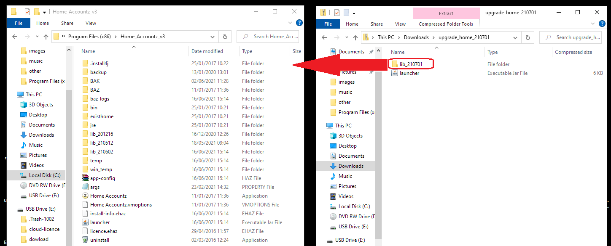

## How to update Home

1. Close Home Accountz
2. Download the zipped folder from here:    
   <https://github.com/accountz-open/download/releases/download/beta_21.07.00/home_lib_210701.zip>   
3. Open the zipped folder named `upgrade_home_210701`
4. Drag the `lib_210701` folder into the Home_Accountz_v3 installation folder    
   Installation folders depend on your computer    

    **Windows**:   
   `C:\Program Files\Home_Accountz_v3`  
    or   
    `C:\Program Files(x86)\Home_Accountz_v3`  
     
    **Mac**:    
    `/Applications/Home_Accountz_v3`

    

5. Open Home Accountz as you would usually.

